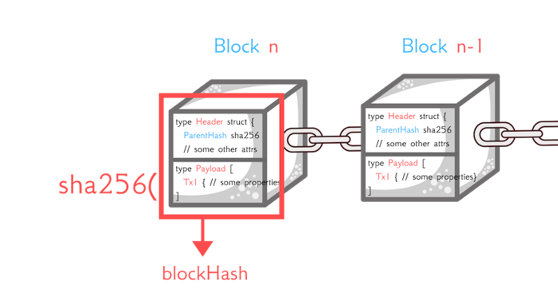

# Data Access Objects

These are all the data access/model objects as follows:

| Object | Description |
| --- | ----------- |
| account | A customer account |
| genesis | This loads the genesis file which is the start of the block chain being the initial state of each account |
| state | The state of the blockchain verified with an sha256 key |
| tx | Handling of transactions / events for the block chain |
| block | One block in the chain which includes sha256 key to ensure sequence integity |

##Block concept

Picture courtesy of [Lukas Lukac](https://gumroad.com/l/build-a-blockchain-from-scratch-in-go) tutorial